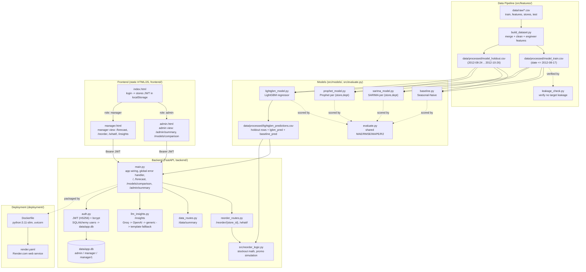

# Architecture

This reflects the system as actually built on `main`, not the original
8-module plan (several modules diverged from their planned scope —
notably auth/LLM/deployment, which were rebuilt directly on `main`
rather than merged from the `module-8` branch; see `README.md`'s module
table for the original plan and the gap against it).

## System diagram

## Notes on what diverged from the original plan

- **Auth/LLM/admin-summary were rebuilt on `main`, not merged from `module-8`.**
  `backend/auth.py` (real PyJWT + bcrypt + SQLAlchemy), `backend/database.py`,
  and `backend/llm_insights.py` (Groq/OpenAI/generic + template fallback) are
  all independent, more complete implementations than what exists on the
  unmerged `module-8` branch. Only `deployment/Dockerfile` and
  `deployment/render.yaml` were cherry-picked from that branch (env vars
  rewritten to match `main`'s actual auth/LLM config).
- **`/data/summary` (`backend/data_routes.py`) previously had its own stub
  auth check** instead of using `backend/auth.py`'s real JWT validation like
  every other endpoint — fixed to use `auth.require_manager_or_admin`.
- **`data/processed/lightgbm_predictions.csv`** is the single file every
  forecast-dependent endpoint (`/forecast`, `/reorder`, `/whatif`) reads
  from. It's produced by `src/models/lightgbm_model.py`'s standalone
  `run_lightgbm_pipeline()` — a self-contained LightGBM regressor, not
  chained through SARIMA/Prophet.
- **Error responses** are normalized by a single global exception handler
  in `backend/main.py` (`http_exception_handler` / `validation_exception_handler`)
  so every error — including FastAPI's default 422 validation errors —
  matches `docs/api_contract.md`'s `{error, message, status_code}` shape.
- **`/models/comparison`** should be read from real, freshly-computed
  evaluation results (baseline/SARIMA/Prophet/LightGBM run against the
  same holdout set) rather than a hardcoded leaderboard.
